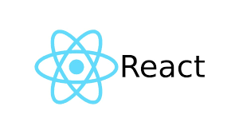

# Resource List for React JS

[Getting Started](https://reactjs.org/docs/getting-started.html)

[Create-React-App](https://reactjs.org/docs/create-a-new-react-app.html)

[React Hooks](https://reactjs.org/docs/hooks-reference.html)

[Context](https://reactjs.org/docs/context.html)

[State](https://reactjs.org/docs/state-and-lifecycle.html)

[React-Router](https://reactrouter.com/web/guides/quick-start)

[Syntax Cheatsheet](https://devhints.io/react)